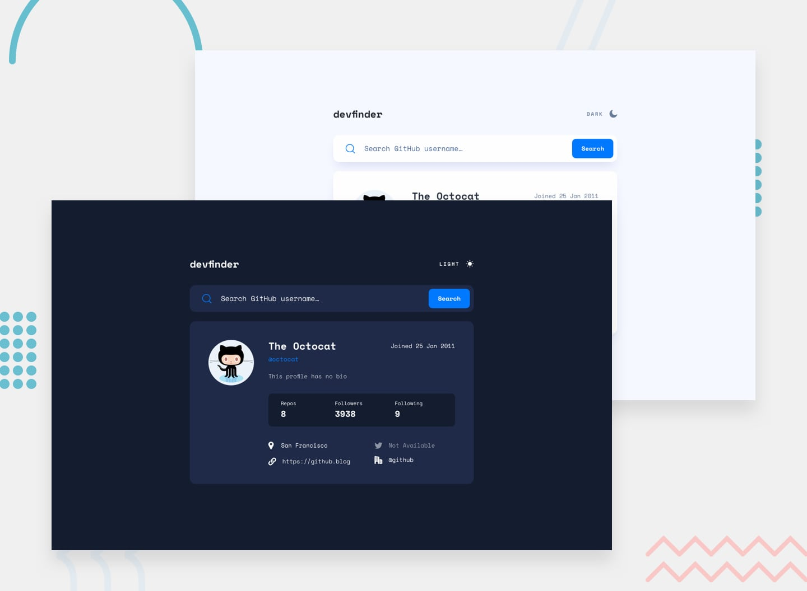

# Frontend Mentor - GitHub user search app solution

This is a solution to the [GitHub user search app challenge on Frontend Mentor](https://www.frontendmentor.io/challenges/github-user-search-app-Q09YOgaH6). Frontend Mentor challenges help you improve your coding skills by building realistic projects.

## Overview

### Design

- Desktop: [here](https://github.com/mgrochalski/github-user-search-app/blob/master/design/)

### Links

- Solution URL: [here](https://github.com/mgrochalski/github-user-search-app)
- Live Site URL: [here](https://mgrochalski.github.io/github-user-search-app/)

### Built with

- CSS / HTML
- [SCSS](https://sass-lang.com/)
- [BEM](https://getbem.com/)
- [ReactJS](https://reactjs.org/)

## Author

- Frontend Mentor - [@mgrochalski](https://www.frontendmentor.io/profile/mgrochalski)
- Github - [mgrochalski](https://github.com/mgrochalski)

